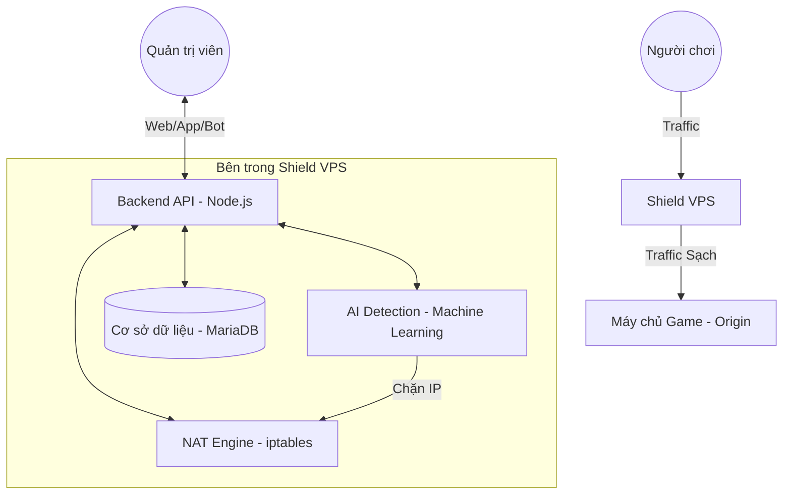

# 🛡️ NRO Shield — Advanced DDoS Proxy & Security Engine

**NRO Shield** là giải pháp bảo mật và chuyển tiếp proxy hiệu năng cao, tích hợp trí tuệ nhân tạo (AI) để bảo vệ game server khỏi các cuộc tấn công DDoS phức tạp. Hệ thống tạo ra một lớp "Khiên" (Shield VPS) để ẩn IP gốc của máy chủ và lọc toàn bộ traffic độc hại.

---

## ✨ Tính năng nổi bật

- **Chuyển tiếp Đa Giao Thức (High-Speed NAT):** Hỗ trợ chuyển tiếp **TCP**, **UDP** và **Both** với độ trễ cực thấp.
- **AI Anomaly Detection:** Tự động phân tích hành vi traffic bằng mô hình Machine Learning (Isolation Forest) để phát hiện và chặn các kết nối bất thường.
- **Cơ chế Mitigate Thông Minh:** Tự động điều khiển `iptables` và `ipset` để chặn IP tấn công trong thời gian thực.
- **Quản lý Đa Nền Tảng:**
  - **Web Dashboard:** Giao diện quản trị hiện đại, theo dõi traffic realtime.
  - **Flutter App (Mobile):** Quản lý server/proxy ngay trên điện thoại (Android/iOS).
  - **Telegram Bot:** Nhận cảnh báo tức thì và điều khiển bot qua lệnh chat.
- **Hardening Bảo Mật:** Tích hợp sẵn `sysctl` security patches, `Fail2Ban`, và `CrowdSec`.
- **MASQUERADE Ready:** Đảm bảo traffic hai chiều thông suốt tuyệt đối cho mọi loại game.

---

## 🏗️ Kiến trúc Hệ thống



---

## 📂 Sơ đồ các thành phần

| Thư mục | Chức năng | Công nghệ |
|:---|:---|:---|
| [`/backend`](./backend) | Core API, Quản lý User/Key/Log | Node.js, Express, Sequelize |
| [`/web`](./web) | Dashboard quản trị trên trình duyệt | HTML, CSS Glassmorphism, JS |
| [`/ai_engine`](./ai_engine) | Phân tích traffic và tự động chặn tấn công | Python, FastAPI, Scikit-learn |
| [`/telegram_bot`](./telegram_bot) | Bot gửi cảnh báo và quản lý nhanh | Node.js, Grammy.js |
| [`/flutter_app`](./flutter_app) | Ứng dụng di động quản lý toàn diện | Flutter, Dart |
| [`/firewall`](./firewall) | Toàn bộ script cấu hình bảo mật hệ thống | Bash, iptables, ipset |

---

## 🚀 Bắt đầu nhanh (Quick Start)

1. **Clone repository:**
   ```bash
   git clone https://github.com/hoangtuvungcao/firewall.git /opt/nroshield
   cd /opt/nroshield
   ```

2. **Chạy script cài đặt:**
   ```bash
   chmod +x firewall/*.sh
   ./firewall/install.sh
   ```

Để cài đặt hệ thống từ A-Z, bạn hãy làm theo hướng dẫn chi tiết tại:

👉 [**HƯỚNG DẪN CÀI ĐẶT CHI TIẾT (SETUP.MD)**](./SETUP.md)

---

## 📜 Giấy phép
Dự án được phát hành dưới giấy phép [**MIT License**](./LICENSE).

*Phát triển bởi ❤️ dành cho cộng đồng NRO.*
